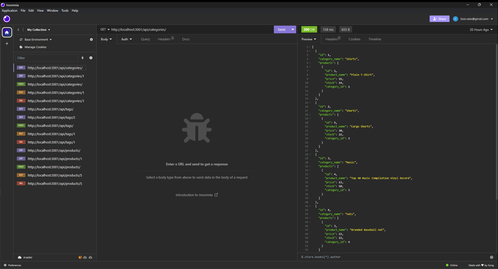

# Supreme Carnival

## Description

Repo URL:https://github.com/alexilson/Supreme-Carnival

Video walkthrough: https://drive.google.com/file/d/10lMKlKDoYKAkFcqKIII-IdztUMN_13SD/view

The Supreme Carnival is a Product Database Backend that is a robust and scalable application that serves as the backbone for managing a wide range of products, categories, and tags. This backend system provides a seamless and efficient way to store, retrieve, and manipulate product data, enabling businesses to effectively manage their inventory and streamline their operations.

## Table of Contents
[Installation](#installation)

[Usage](#usage)

[License](#license)

[Contributing](#contributing)

[Tests](#tests)

[Questions](#questions)

## Installation
Clone repository, run npm install, run the schema.sql file to create the database. Add your credentials to the .env file. Then run npm run seed to seed the database and test your connection. Now you can connect using your frontend tester of choice.

## Usage
Send http requests to http://localhost:3001/api/\*type of request\*/\*option id parameter\* where the \*type of request\* is either categories, products, or tags. Send a GET request to / to get a list of objects. Send a GET request with an id parameter to get a particular object. Send a POST request with a body containing the data to create an object. Send a PUT request with an ID parameter and a body with the data to update an object. Send a DELETE request with an ID parameter to delete an object. 

## Questions
For additional questions, please contact me here:

GitHub: https://www.github.com/alexilson

Email: ilson.alex@gmail.com
